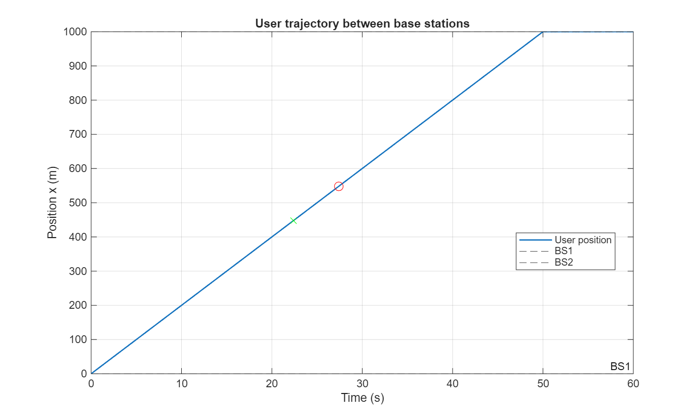
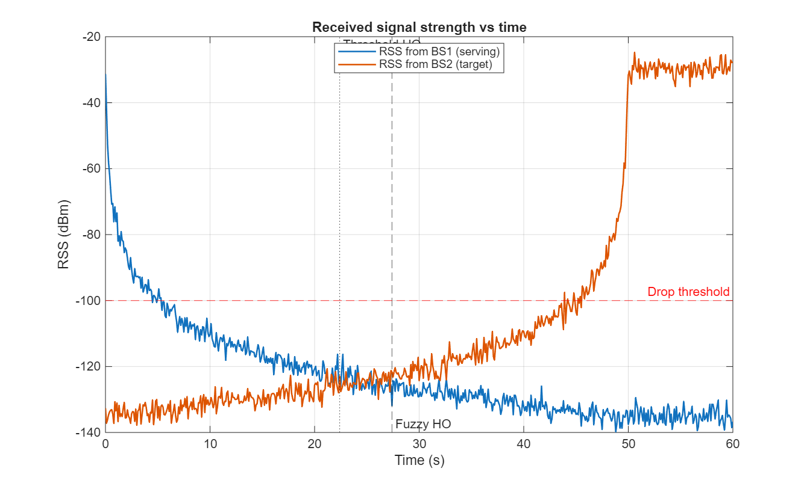
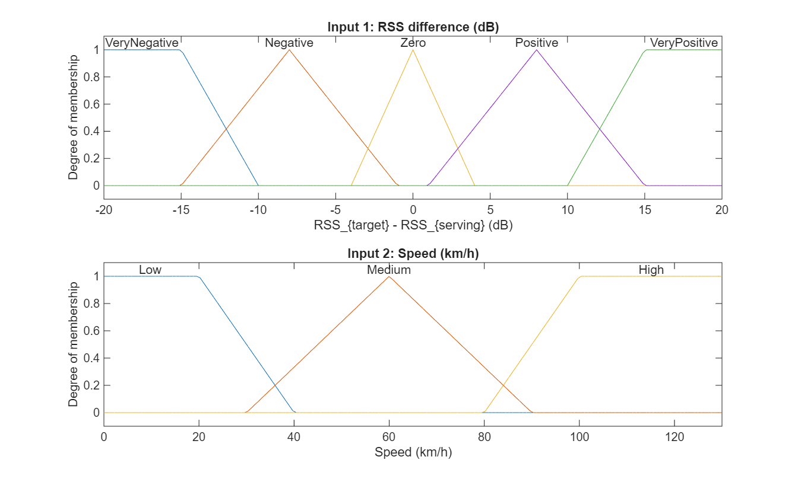
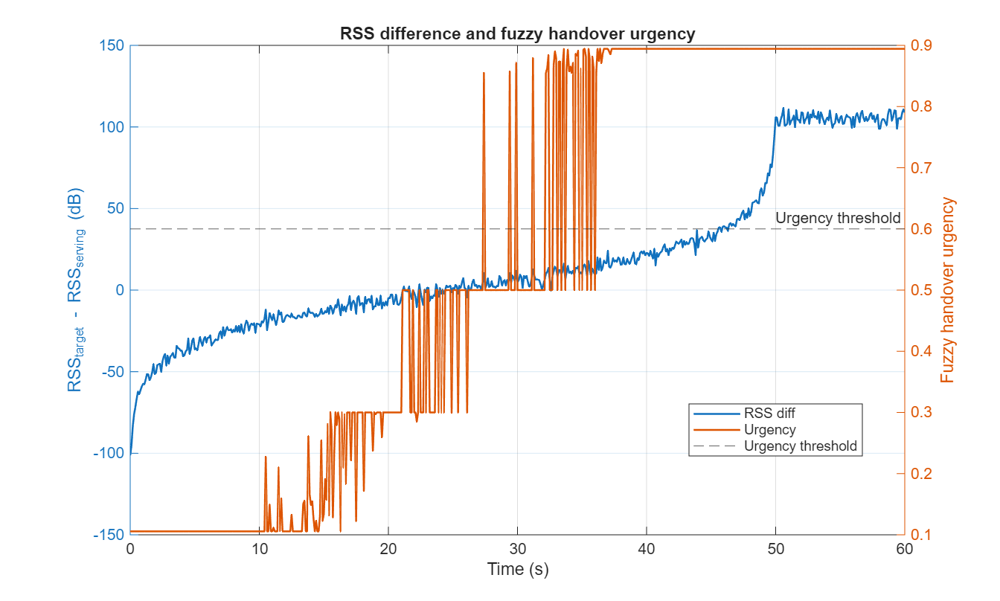

# Fuzzy-Logic-Based Handover Decision in a Cellular Network

This project implements a **fuzzy-logic controller** for deciding when to hand over a mobile user from one base station (BS) to another in a simple cellular scenario, using MATLAB and the Fuzzy Logic Toolbox.

The idea is to compare a **traditional threshold rule** (“handover when `RSS_target − RSS_serving ≥ 3 dB`”) with a **fuzzy handover decision** based on:

- the difference in received signal strength (RSS), and  
- the user’s speed.

All simulation code and plotting is contained in two files:

- `buildHandoverFIS.m` – builds the MATLAB `mamfis` object.  
- `run_fuzzy_handover_sim.m` – runs the scenario, evaluates the FIS, and generates figures.

---

## 1. Problem Description

In a cellular network, a mobile device connected to a serving BS should be transferred to a neighbouring BS when that neighbour provides a better signal. If the handover is:

- **too early**, this can cause unnecessary handovers and “ping-pong” effects;  
- **too late**, the user may experience very weak signal and possible call drops.

Most real systems use rules based on RSS, margins and timers. Here, a fuzzy-logic controller outputs a **handover urgency** in the range [0, 1], which is then thresholded to decide when to trigger the handover.

---

## 2. System Model

### Geometry and mobility

- Two base stations on a line, separated by **D = 1000 m**.  
- The user starts close to BS1 and moves towards BS2 with constant speed:
  - `v = 20 m/s` (≈ 72 km/h).
- Simulation time step: `dt = 0.1 s`.

The resulting trajectory is shown in **Figure 1**.

  
*Figure 1 – User position vs time. The green marker shows the threshold-based handover location; the red circle shows the fuzzy handover location.*

### Radio propagation

For each time step, the received signal strength from each base station is modelled using a log-distance path-loss model with shadowing:

- Transmit power: `Ptx = -30 dBm` (arbitrary reference value).  
- Path-loss exponent: `n = 3.5`.  
- Log-normal shadowing noise: Gaussian with standard deviation `σ = 2 dB`.

A simple **drop threshold** is set at −100 dBm to indicate very weak signal. This is not a full QoS model, just a rough indicator.

The RSS time series are shown in **Figure 2**.

  
*Figure 2 – RSS from BS1 (serving) and BS2 (target). Vertical lines mark the handover times for the two schemes. The red dashed line is the drop threshold.*

---

## 3. Fuzzy Controller Design

The fuzzy inference system (FIS) is implemented using MATLAB’s `mamfis` object with Mamdani inference.

### Inputs

1. **RSS difference**

   `x1 = RSS_target - RSS_serving` (in dB)

   - Domain: [-20, 20] dB  
   - Membership functions:
     - *VeryNegative*, *Negative*, *Zero*, *Positive*, *VeryPositive*  
       (triangular and trapezoidal shapes)

2. **User speed**

   `x2 = speed` (in km/h)

   - Domain: [0, 130] km/h  
   - Membership functions:
     - *Low*, *Medium*, *High*

The input membership functions are illustrated in **Figure 3**.

  
*Figure 3 – Membership functions for RSS difference and speed.*

### Output

The FIS has a single output:

- **Handover urgency** `y` in [0, 1]

  - Membership functions:
    - *VeryLow*, *Low*, *Medium*, *High*, *VeryHigh*

The output membership functions are shown in **Figure 4**.

  
*Figure 4 – Membership functions for the handover urgency output.*

### Rule base

The rule base captures basic intuition about when handover should be urgent:

1. IF RSSdiff is *VeryNegative* THEN Urgency is *VeryLow*  
2. IF RSSdiff is *Negative* THEN Urgency is *Low*  
3. IF RSSdiff is *Zero* AND Speed is *Low* THEN Urgency is *Medium*  
4. IF RSSdiff is *Zero* AND Speed is *High* THEN Urgency is *High*  
5. IF RSSdiff is *Positive* AND Speed is *Low* THEN Urgency is *High*  
6. IF RSSdiff is *Positive* AND Speed is *High* THEN Urgency is *VeryHigh*  
7. IF RSSdiff is *VeryPositive* THEN Urgency is *VeryHigh*

The FIS uses:

- AND: `min`  
- OR: `max`  
- Implication: `min`  
- Aggregation: `max`  
- Defuzzification: **centroid**

Because the raw RSS difference can become very large when the user is extremely close to one BS and far from the other, the value passed into the FIS is **clipped** to the range [-20, 20] dB. This keeps the inference focused on the region where the decision is actually ambiguous.

---

## 4. Decision Logic and Metrics

Two schemes are compared:

1. **Threshold-based handover**

   - Trigger when `RSS_target - RSS_serving ≥ 3 dB`.

2. **Fuzzy handover**

   - Evaluate the FIS at each time step.  
   - Trigger when **urgency ≥ 0.6**.

In addition, a simple “drop” check is used:

- Before handover, the serving BS is BS1; after handover, it is BS2.  
- If the serving RSS goes below −100 dBm at any point in a given interval,
  that interval is flagged as having at least one low-RSS event.

This metric is intentionally simple and just serves to compare the two schemes qualitatively.

---

## 5. Simulation Results

For the default parameters included in the code, the simulation produces:

- **User speed:** 72 km/h  
- **Threshold scheme:**
  - Handover at approximately `t ≈ 22.4 s`, `x ≈ 448 m`  
- **Fuzzy scheme:**
  - Handover at approximately `t ≈ 27.4 s`, `x ≈ 548 m`

From **Figure 1**, the threshold-based scheme hands over earlier (green marker),
while the fuzzy controller triggers closer to the mid-point between the BSs (red marker).

From **Figure 2**, we can see the evolution of RSS from both base stations. The crisp handover happens soon after BS2 starts to outperform BS1. The fuzzy controller waits until `RSS_target` is noticeably stronger relative to `RSS_serving` before its urgency crosses the decision threshold.

The relationship between RSS difference and urgency over time is shown in **Figure 5**.

  
*Figure 5 – `RSS_target − RSS_serving` (left axis) and fuzzy handover urgency (right axis). The dashed line marks the urgency threshold used for the decision.*

Observations:

- When the user is close to BS1, the RSS difference is strongly negative and the urgency stays low.  
- In the cell-edge region, the RSS difference fluctuates around 0 dB, and the urgency rises as the rules involving *Zero*, *Positive* and *High speed* begin to fire.  
- Once the user is clearly closer to BS2, the clipped RSS difference moves into the *Positive* / *VeryPositive* region and urgency saturates at a high value. The handover is triggered when the urgency first exceeds 0.6.

Because of the added shadowing noise, both schemes can experience isolated low-RSS samples on either side of the handover point. The current code reports whether any such samples occur; it can easily be extended to count them or compute the total time spent below the drop threshold.

---

## 6. References 
1. T. S. Rappaport, *Wireless Communications: Principles and Practice*, 2nd ed., Prentice Hall, 2002.
2. 2. A. Goldsmith, *Wireless Communications*, Cambridge University Press, 2005.
3. J. G. Proakis and M. Salehi, *Digital Communications*, 5th ed., McGraw–Hill, 2008. (Chapters on fading channels, path loss, and mobile radio propagation.)

